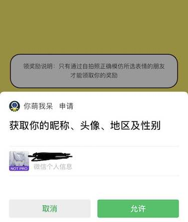

# wxapp-authorize
解决微信拒绝授权问题。

2018-04-25之后最新微信小程序授权方式，拒绝授权后重新授权。

由于微信小程序底层授权方式不再支持直接通过wx.getUserInfo的方式，需要通过button组件才能唤起授权弹窗，所以我们需要针对这种情况进行一次升级。

## 效果
需要授权昵称等信息时，弹出本组件：


点击确定则弹出微信默认授权窗口：


## 思路

首先，如果你的小程序必须要获取用户信息，则主流程的逻辑必须放在授权成功`success`后的回调函数中。

用户进入小程序时，我们调用一次组件内的授权方法，如果由于微信api的问题导致获取用户信息失败，则显示我们定义的组件，提示用户主动授权。

- 用户点击`取消`按钮，则关闭组件弹窗，用户无法继续操作小程序。
- 用户点击`确定`按钮，则触发了微信`button`授权组件，显示微信默认的授权窗口。
  - 用户如果点击`拒绝`或`取消`按钮，会触发`fail`事件，再次显示授权组件
  - 用户如果点击`允许`按钮，如果失败，则和取消授权一致的表现，成功则执行主要逻辑


## 使用方法

**拷贝components/wx-authorize目录到你自己的项目中**，然后按照示例代码操作。

简要目录结构如下（这都不重要）：

```
├── pages
│   ├── home
│   │   ├── home.vue
│   │   └── main.js
├── main.js
└── components
    ├── wx-authorize
    │   ├── Authorize.vue   // 提示授权的弹窗
    │   └── oauth.js   // 小程序授权相关函数
    
```


### 例子
具体代码见`src/pages`目录

```html
<authorize-modal 
  v-if="needAuthorize"
  :logo="logoUrl" 
  mp-name="小程序名称" 
  @on-cancel="closeAuthorizeModal" 
  @on-confirm="authorize()">
</authorize-modal>
```

授权逻辑
```javascript
import AuthorizeModal from '@/components/wx-authorize/Authorize'
import Authorize from '@/components/wx-authorize/oauth'

export default {
  components: { AuthorizeModal },
  data(){
    return {
      needAuthorize: false
    }
  },
  mounted(){
    this.authorize();
  },
  methods: {
    closeAuthorizeModal(){
      this.needAuthorize = false
    },
    authorize(){
      const self = this
      const wxAuth = new Authorize()
      wxAuth.authroize({
        success: self.init,
        fail: function(){
          self.needAuthorize = true
        }
      })
    },

    // 授权成功后，初始化
    init(code, data){
      this.closeAuthorizeModal();
      console.log('wx.login return code:', code);
      console.log('getUserInfo:', data);
    }
  }
}
```

### API
| 参数 | 说明 | 类型 | 可选值 | 默认值 |
|---|---|---|---|---|
| logo | 小程序logo | String |   |   |
| mpName | 小程序名称 | String |   |   |
| onCancel | 取消授权回调 | Function |   |   |
| onConfirm | 确定授权回调 | Function |   |   |


## 疑惑？
1. `wx.login`之后可以直接调用`wx.getUserInfo`？
  比如，在示例中，`mounted`内部直接调用了`this.authorize()`居然成功了？还是说我测试不充分？

