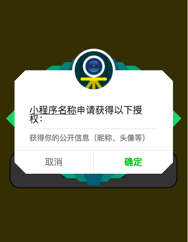

# wxapp-authorize
2018-04-25之后最新微信小程序授权方式，拒绝授权后重新授权

由于微信小程序底层授权方式不再支持直接通过wx.getUserInfo的方式，需要通过button组件才能唤起授权弹窗，所以我们需要针对这种情况进行一次升级。

效果如图，点击确定则弹窗微信默认授权窗口：



## 使用方法
简要目录结构如下（这都不重要）：

```
├── pages
│   ├── home
│   │   ├── home.vue
│   │   └── main.js
├── main.js
└── components
    ├── wx-authorize
    │   ├── Authorize.vue   // 提示授权的弹窗
    │   └── oauth.js   // 小程序授权相关函数
    
```

如在home页授权

### 引入

```javascript
import AuthorizeModal from '@/components/wx-authorize/Authorize'
import Authorize from '@/components/wx-authorize/oauth'

export default {
}
```

### 例子
具体代码见`src`目录

```html
<authorize-modal 
  v-if="needAuthorize"
  :logo="logoUrl" 
  mp-name="小程序名称" 
  @on-cancel="closeAuthorizeModal" 
  @on-confirm="authorize()">
</authorize-modal>
```

授权逻辑
```javascript
import AuthorizeModal from '@/components/wx-authorize/Authorize'
import Authorize from '@/components/wx-authorize/oauth'

export default {
  components: { AuthorizeModal },
  data(){
    return {
      needAuthorize: false
    }
  },
  mounted(){
    const self = this
    const wxAuth = new Authorize()

    // 先直接授权，如果失败了会进入fail，展示需授权提示
    wxAuth.authroize({
      success: self.init,
      fail: function(){
        self.needAuthorize = true
      }
    })
  },
  methods: {
    closeAuthorizeModal(){
      this.needAuthorize = false
    },
    authorize(callback){
      const self = this
      self.needAuthorize = false

      const wxAuth = new Authorize()
      wxAuth.authroize({
        success: self.init,
        fail: function(){
          self.needAuthorize = true
        }
      })
    },

    // 授权成功后，初始化
    init(){

    }
  }
}
```

### API
| 参数 | 说明 | 类型 | 可选值 | 默认值 |
|---|---|---|---|---|
| logo | 小程序logo | String |   |   |
| mpName | 小程序名称 | String |   |   |
| onCancel | 取消授权回调 | Function |   |   |
| onConfirm | 确定授权回调 | Function |   |   |